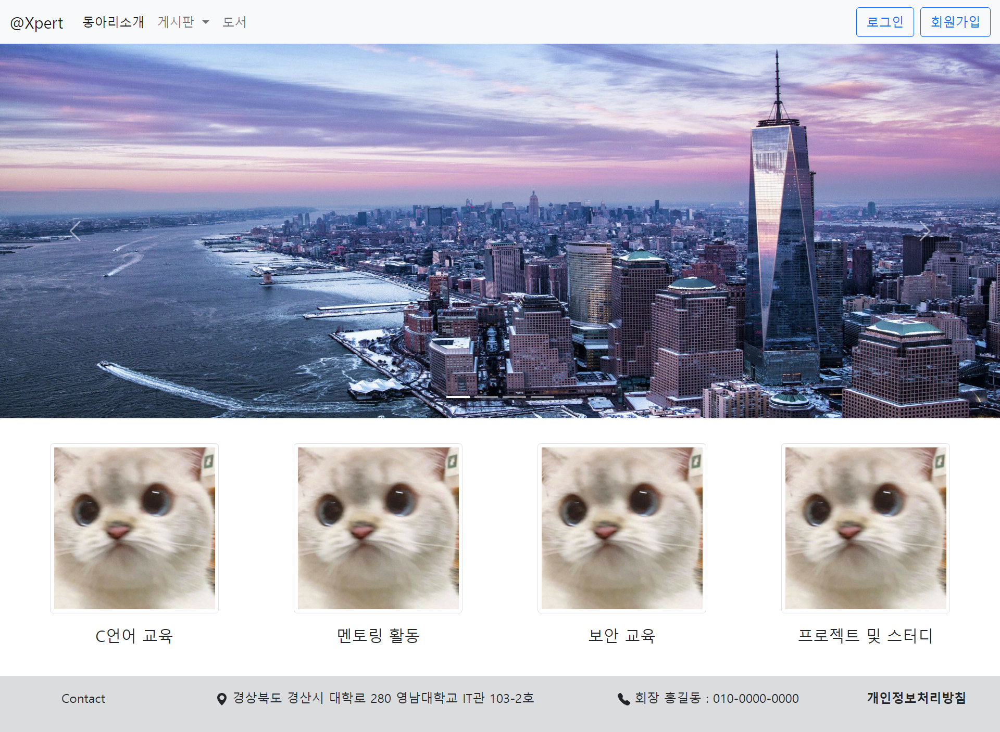

# SocietyConnection



Node.js와 Express.js로 구현한 동아리 홈페이지입니다.

## Getting Started / 어떻게 시작하나요?

아래의 명령어로 서버를 실행하시면 됩니다.
```
npm start
```

### Prerequisites / 선행 조건

아래 사항들이 설치 및 세팅이 되어있어야 하며 카카오 로그인을 사용하기 위해서 카카오 REST API 키를 발급하셔야 합니다.

```
MySQL Server 8.0 이상, Node.js 16.13.0 이상, npm 8.1.0 이상
```

### 모듈 설치
아래의 명령어로 필요한 모듈들을 설치합니다.

```
npm install
```

### 카카오 REST API 키 발급 및 설정
1. [Kakao Developers](https://developers.kakao.com/) 사이트에 접속하여 로그인 후 내 애플리케이션 메뉴에 가서 애플리케이션 추가하기를 클릭

2. 앱 이름과 회사 이름을 아무거나 입력하고 저장하여 앱을 생성

3. REST API 키를 복사하여 .env 파일의 "KAKAO_ID"에 입력

4. 앱 설정 > 플랫폼에서 Web 플랫폼 등록 메뉴를 선택하고 "http://도메인" 을 입력 후 저장

5. 제품 설정 > 카카오 로그인 메뉴에서 활성화 설정 상태 스위치를 ON으로 설정한 후 Redirect URI를 "http://도메인/auth/kakao/callback" 로 설정

6. 제품 설정 > 카카오 로그인 > 동의항목 메뉴에서 닉네임, 프로필 사진 필수 동의 및 카카오계정, 성별, 연령대, 생일 선택 동의로 설정(※카카오 계정으로 정부 수집 후 제공 체크 필수)

7. 제품 설정 > 카카오 로그인 > 고급 메뉴에서 Logout Redirect URI를 "http://도메인/auth/logout" 로 설정

### .env 환경 파일 세팅
1. 프로젝트 최상단 경로에 .env 파일을 생성 후 아래의 내용을 복사

```
PORT=80
NODE_ENV=production
COOKIE_SECRET=escapexpert
KAKAO_ID=카카오 REST API 키
KAKAO_LOGOUT_REDIRECT_URI=http://도메인/auth/logout
SEQUELIZE_PRODUCTION_USERNAME=MySQL 아이디
SEQUELIZE_PRODUCTION_PASSWORD=MySQL 비밀번호
SEQUELIZE_PRODUCTION_HOST=MySQL 서버 주소
```

2. .env 파일의 KAKAO_ID에 위에서 발급 받은 키와 SEQUELIZE_*에 MySQL 서버 관련 정보를 입력

3. KAKAO_LOGOUT_REDIRECT_URI에 도메인 입력

4. 아래의 명령어로 데이터베이스 생성
```
npx sequelize db:create --env production
```

## Built With / 누구랑 만들었나요?

* [박세훈](https://github.com/psh3253) - 프로젝트 및 DB 설계, 게시판 기능 구현 및 디자인 등
* [김민수](https://github.com/munis-kim) - 프로젝트 및 DB 설계, 쪽지 기능 구현 및 디자인 등
* [마상균](https://github.com/wodon326) - 프로젝트 및 DB 설계, 인증, 프로필, 관리 기능 구현 및 디자인 등

## Function / 기능
+ 로그인 및 회원가입
+ 카카오 계정을 이용한 소셜 로그인
+ 일반 게시판
+ 모집 전용 게시판
+ 프로필 보기 및 수정
+ 홈페이지 관리
+ 쪽지

## Technology / 기술

+ Multer을 사용하여 사진 및 첨부파일 저장
+ Kakao Rest API를 사용하여 카카오 로그인 구현
+ Sequelize ORM을 사용하여 데이터베이스 관리
+ 네이버 Smart Editor 2.0을 사용하여 글쓰기 폼 구현
+ PM2를 사용하여 무중단 배포
+ Redis에 세션 정보를 저장하여 서버 재시작 후 로그인 유지

## License / 라이센스

이 프로젝트는 GPL-3.0 라이센스로 라이센스가 부여되어 있습니다. 자세한 내용은 LICENSE 파일을 참고하세요.